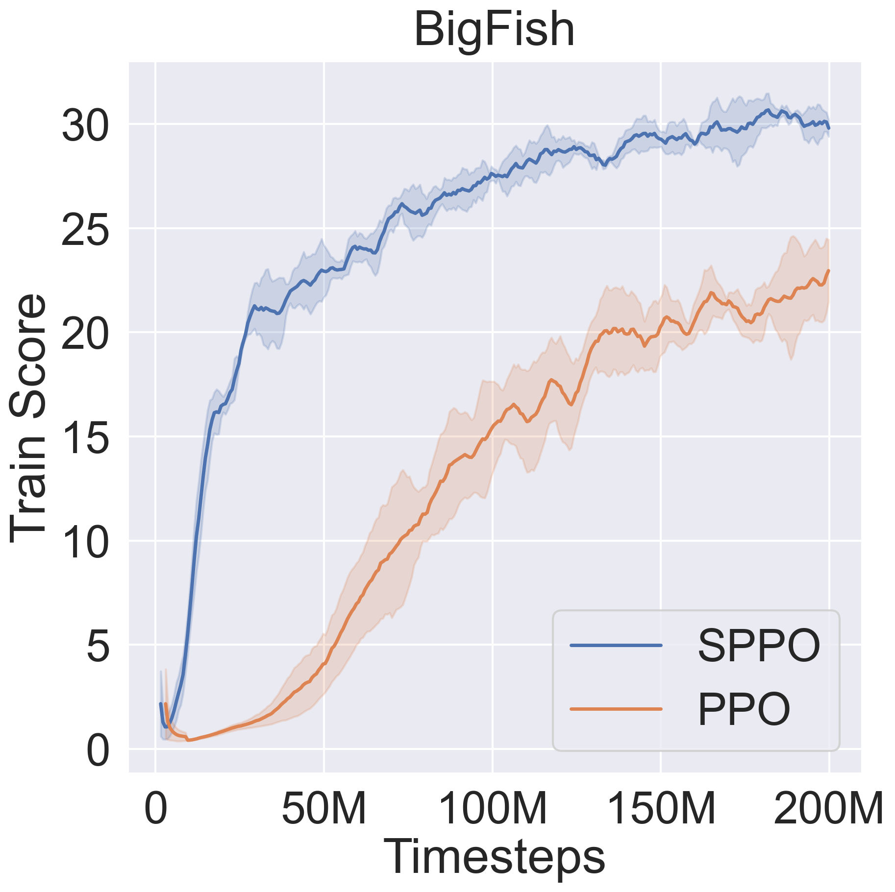
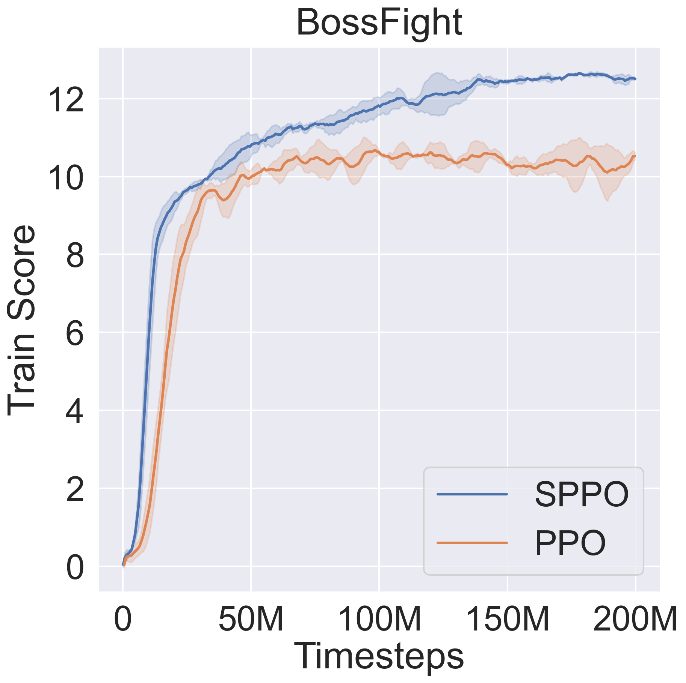
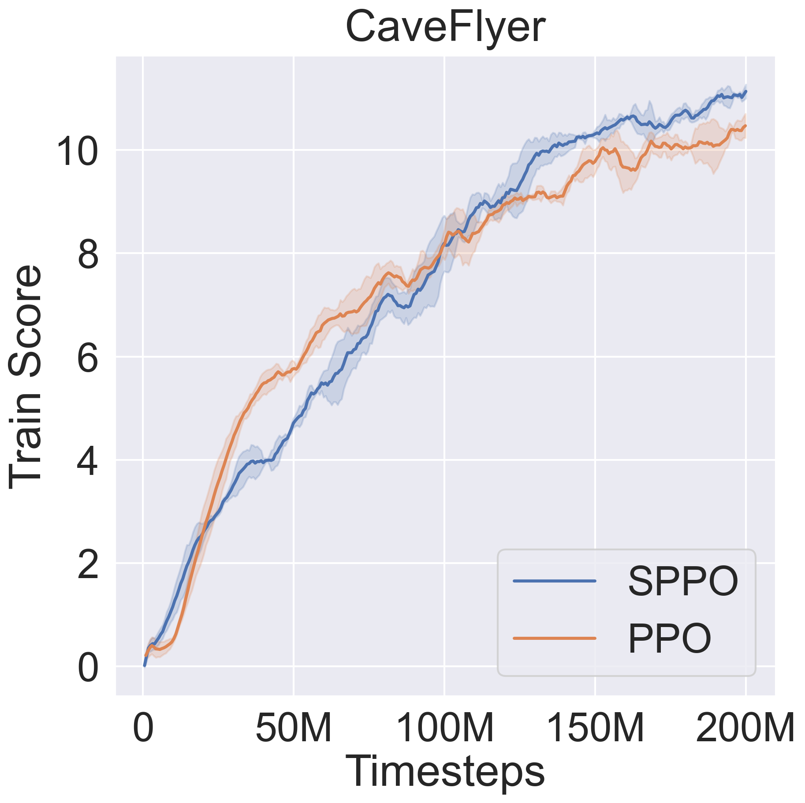
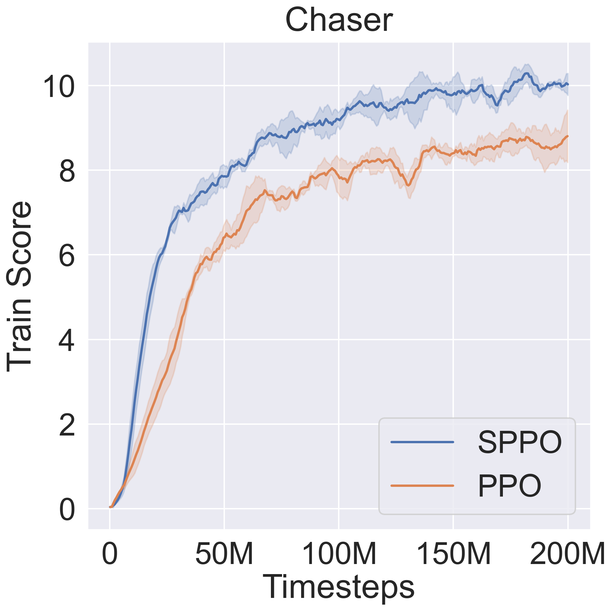
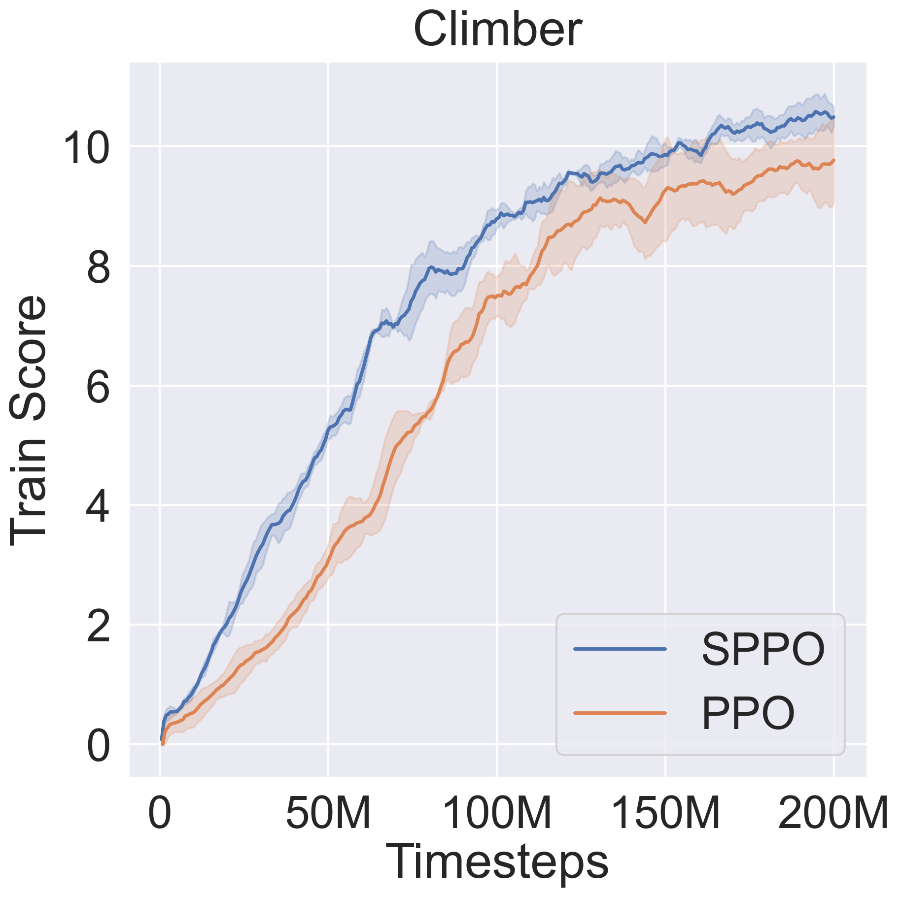
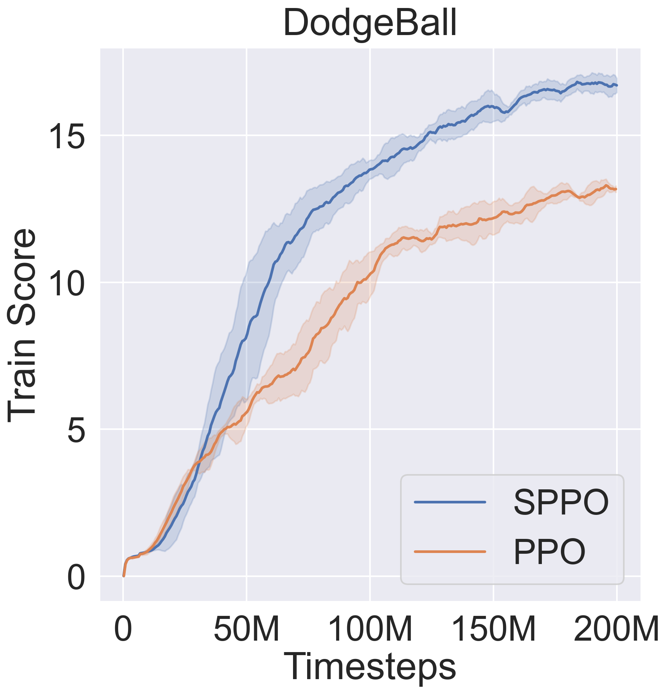
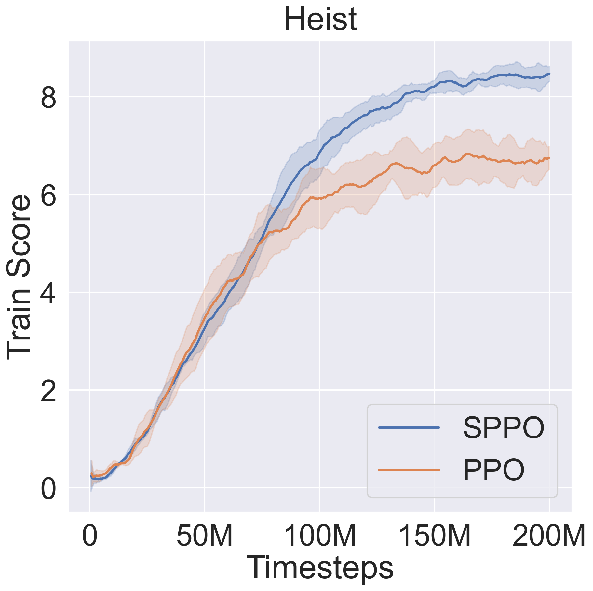
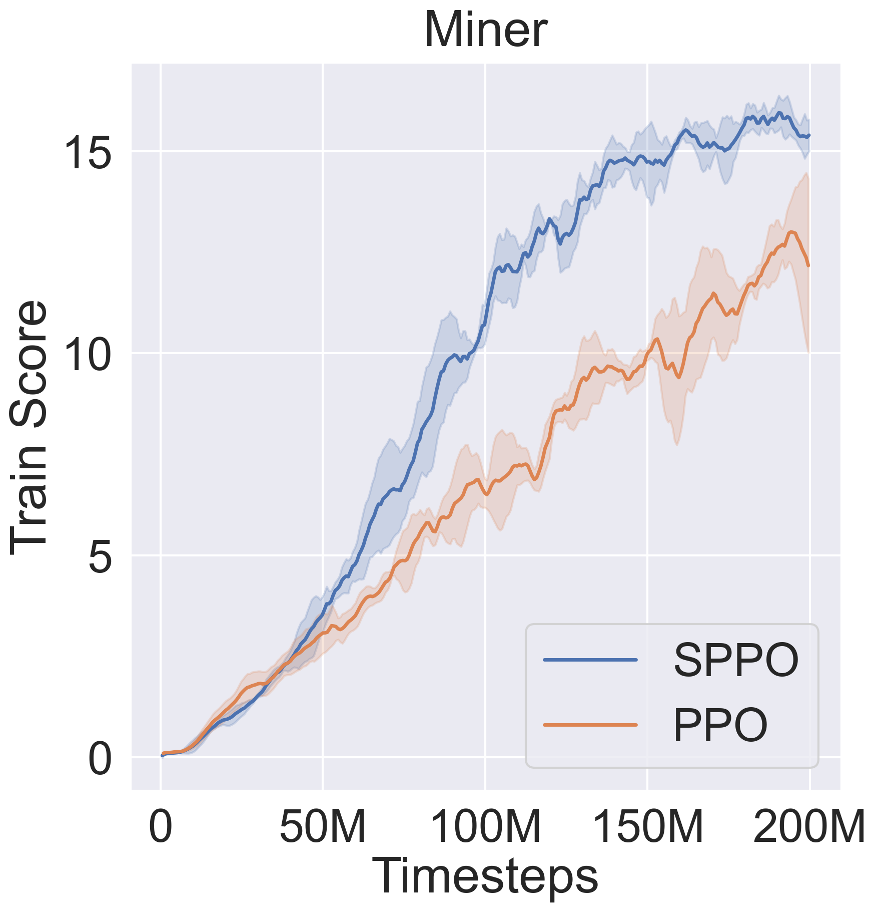
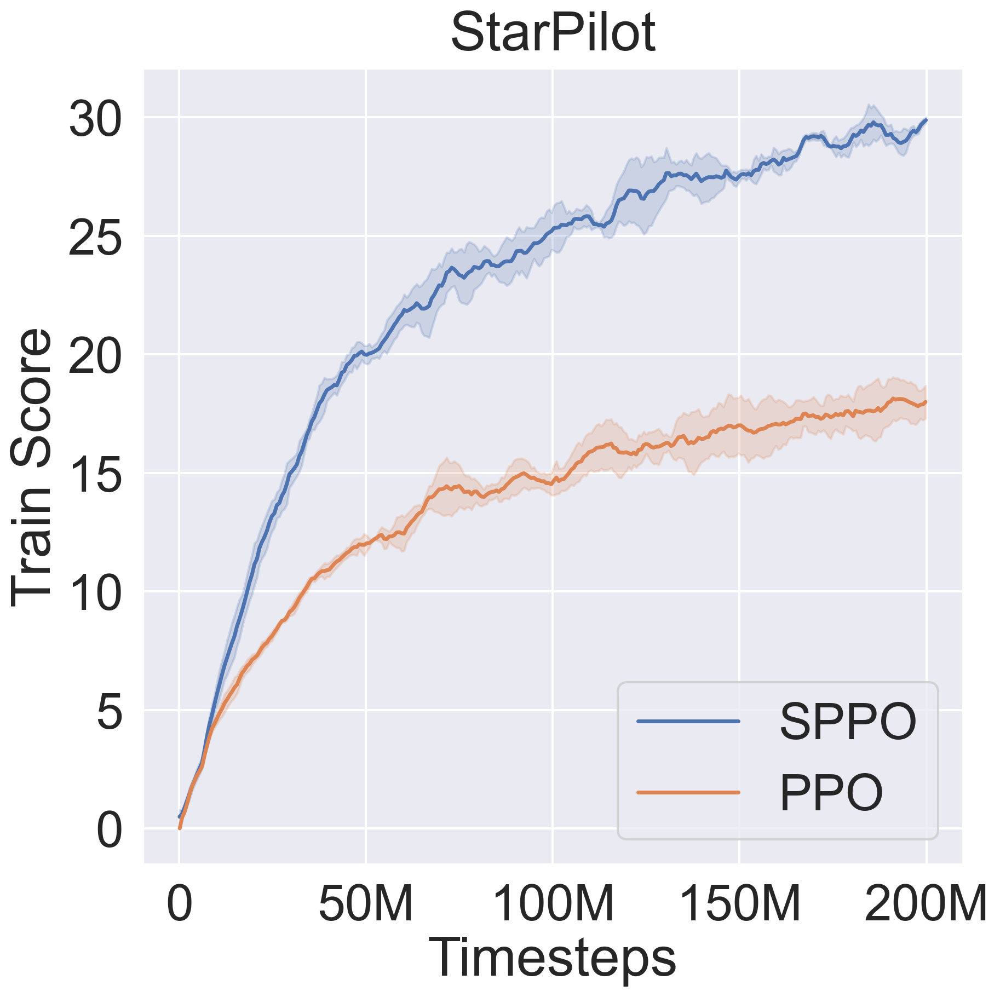

# OmniRL-Procgen

English | [简体中文](README.zh-CN.md)

**SPPO: A Practical Recipe for Strong PPO in Procgen**

OmniRL-Procgen is a controlled comparison of PPO and SPPO on procedurally generated game environments. It is built on the distributed reinforcement learning framework provided by [OmniRL](https://github.com/MBer123/omnirl); refer to the OmniRL repository for the framework architecture, runtime, and shared interfaces.

## Method

SPPO is a PPO-based recipe for visual on-policy reinforcement learning. It adapts representation learning, normalization, and augmentation-aware optimization techniques to PPO, with separate treatment of the actor and critic.

| Component | Role in SPPO |
| --- | --- |
| [PPO](https://arxiv.org/abs/1707.06347) | Provides the clipped surrogate objective and the base actor-critic update. |
| [SPR](https://arxiv.org/abs/2007.05929) | Predicts multi-step future latent representations with an action-conditioned transition model and an EMA target network. |
| [RMSNorm](https://proceedings.neurips.cc/paper/2019/hash/1e8a19426224ca89e83cef47f1e7f53b-Abstract.html) | Improves the [IMPALA-CNN](https://proceedings.mlr.press/v80/espeholt18a.html) backbone by normalizing flattened convolutional features before the latent projection. |
| Separate Heads | Uses separate actor and critic heads: [LayerNorm](https://arxiv.org/abs/1607.06450) for the actor and RMSNorm for the critic. |
| [SADA](https://rlj.cs.umass.edu/2024/papers/Paper26.html)-actor | Adapts the SADA idea by averaging PPO actor losses computed from the original and random-shift observations. |
| [DrAC](https://proceedings.neurips.cc/paper_files/paper/2021/hash/2b38c2df6a49b97f706ec9148ce48d86-Abstract.html)-actor | Regularizes the augmented policy toward the original policy with KL divergence. |
| [SVEA](https://proceedings.neurips.cc/paper/2021/hash/1e0f65eb20acbfb27ee05ddc000b50ec-Abstract.html)-critic | Adapts the SVEA idea by regressing values from original and augmented observations toward the same return target. |
| RewardNorm | Scales rewards by the running standard deviation of discounted returns, synchronizes statistics across learners, and clips normalized rewards. |

Let $g$ denote random-shift augmentation, $\hat{R}$ the return target computed from normalized rewards, and $\mathrm{sg}$ stop-gradient. The PPO clipped surrogate loss is

```math
\begin{aligned}
\mathcal{L}_{\mathrm{PPO}}^{\mathrm{clip}}(x)
&=
-\mathbb{E}_t
\left[
\min\left(
r_t(x)\hat{A}_t,\,
\mathrm{clip}\left(r_t(x),1-\epsilon,1+\epsilon\right)\hat{A}_t
\right)
\right], \\
r_t(x)
&=
\frac{\pi_\theta(a_t \mid x)}
{\pi_{\mathrm{old}}(a_t \mid s_t)},
\qquad
x \in \{s_t,g(s_t)\},
\end{aligned}
```

where $\hat{A}_t$ is the normalized advantage estimate and $\epsilon$ is the PPO clipping range. The augmentation-aware actor and critic losses are

```math
\begin{aligned}
\mathcal{L}_{\mathrm{actor}}
&=
\frac{1}{2}\mathcal{L}_{\mathrm{PPO}}^{\mathrm{clip}}(s)
+
\frac{1}{2}\mathcal{L}_{\mathrm{PPO}}^{\mathrm{clip}}(g(s)), \\
\mathcal{L}_{\mathrm{critic}}
&=
\frac{1}{2}\lVert V(s)-\hat{R}\rVert_2^2
+
\frac{1}{2}\lVert V(g(s))-\hat{R}\rVert_2^2.
\end{aligned}
```

DrAC-actor adds the policy consistency loss

```math
\mathcal{L}_{\mathrm{DrAC}}
=
D_{\mathrm{KL}}
\left(
\mathrm{sg}[\pi(\cdot \mid s)]
\;\middle\|\;
\pi(\cdot \mid g(s))
\right).
```

The complete optimization objective is

```math
\mathcal{L}_{\mathrm{SPPO}}
=
\mathcal{L}_{\mathrm{actor}}
+ c_v\mathcal{L}_{\mathrm{critic}}
- c_H\mathcal{H}(\pi)
+ c_{\mathrm{SPR}}\mathcal{L}_{\mathrm{SPR}}
+ c_{\mathrm{DrAC}}\mathcal{L}_{\mathrm{DrAC}},
```

where the loss coefficients and SPR prediction horizon are configured in the agent YAML.

## Environments

Procgen Benchmark is a set of procedurally generated game environments for evaluating the sample efficiency and generalization ability of reinforcement learning algorithms.

The experiments use the `hard` distribution mode. Training and test level ranges are configured independently in each experiment.

| Environment | Description |
| --- | --- |
| `bigfish` | Control a small fish, eat smaller fish to grow, and avoid larger fish. |
| `bossfight` | Control a spaceship, fight the boss, dodge attacks, and find openings to deal damage. |
| `caveflyer` | Fly through a cave to reach the exit while avoiding walls, obstacles, and enemies. |
| `chaser` | A Pac-Man-like maze environment where the agent collects targets and handles chasing enemies. |
| `climber` | A platforming environment where the agent climbs upward and collects rewards. |
| `dodgeball` | Dodge enemies and projectiles in a room, and defeat enemies to finish the level. |
| `heist` | Navigate a maze, collect keys, open matching locks, and obtain the gem. |
| `miner` | Dig through the map, collect diamonds, and avoid hazards such as falling rocks. |
| `starpilot` | A side-scrolling shooter where the agent dodges enemies and bullets while destroying targets. |

For detailed game rules, environment options, and the original implementation, refer to [openai/procgen](https://github.com/openai/procgen).

## Installation

OmniRL-Procgen requires 64-bit Python 3.10 because the Procgen 0.10.7 backend does not provide wheels for Python 3.11 or newer. Create a virtual environment:

```bash
python -m venv .venv
```

Activate it on Windows:

```powershell
.\.venv\Scripts\Activate.ps1
```

On Linux and macOS:

```bash
source .venv/bin/activate
```

Install OmniRL-Procgen and the Procgen environment backend:

```bash
python -m pip install --upgrade pip
pip install -e .
pip install -r requirements/procgen.txt
```

The backend requirements file includes `base.txt` and can be installed directly in a fresh environment.

For GPU training, install the PyTorch build that matches the operating system and CUDA runtime, then verify CUDA availability:

```bash
python -c "import torch; print(torch.cuda.is_available())"
```

## Getting Started

An OmniRL-Procgen run uses two YAML files:

- The runner configuration defines the Procgen environment, Ray worker counts, device, seeds, checkpoints, and logging.
- The agent configuration defines PPO or SPPO and its learner, memory, policy, and network parameters.

Start a single-machine SPPO run on BigFish:

```bash
python run.py --mode train --runner-config experiments/bigfish/sppo-0/train.yaml --agent-config experiments/bigfish/sppo-0/sppo.yaml
```

`run.py` connects to an existing Ray cluster when available; otherwise, it starts a local Ray runtime. For multi-node execution, start the head node:

```bash
ray start --head --port=6379
```

Join each worker, then launch `run.py` from the head node:

```bash
ray start --address=<head-ip>:6379
```

Configurations follow `experiments/<environment>/<algorithm>-<seed>`. When `runner.load_checkpoint` is `true`, restarting the same training command resumes from `checkpoint.ckpt` in `runner.ckpt_dir`.

### Outputs

Each run writes the following artifacts to `runner.ckpt_dir`:

- `checkpoint.ckpt`: complete learner and optimizer state for resuming training.
- `agent_<version>.pth`: exported policy weights.
- `log.csv`: runtime, evaluation, and learner metrics.
- `run_config.yaml`: merged runner and algorithm configuration used by the run.

## Evaluation

Set `runner.ckpt_dir` and `runner.eval_model` in the matching `test.yaml`, then run:

```bash
python run.py --mode test --runner-config experiments/bigfish/sppo-0/test.yaml --agent-config experiments/bigfish/sppo-0/sppo.yaml
```

The Procgen backend evaluates the configured training and test level ranges and reports their return mean, standard deviation, maximum, and minimum.

To watch the agent, set `env.render_mode` to `human` and `runner.num_evaluators` to `1` in the test configuration.

## Experiments

The experiments compare PPO and SPPO across nine Procgen environments:

| Setting | Value |
| --- | --- |
| Algorithms | PPO, SPPO |
| Environments | BigFish, BossFight, CaveFlyer, Chaser, Climber, DodgeBall, Heist, Miner, StarPilot |
| Seeds | 0, 1, 2 |
| Distribution mode | `hard` |
| Training levels | 500 |
| Held-out test levels | 100 |
| Updates per run | 3,052 |
| Total runs | 54 |

Configurations are stored under `experiments/<environment>/<algorithm>-<seed>`, and checkpoints, logs, and merged run configurations are written under `results/<environment>/<algorithm>-<seed>`.

The solid lines show the three-seed mean training score, and the shaded regions show one standard deviation.

<p align="center">
  
  
  
</p>

<p align="center"><em>BigFish (left), BossFight (center), and CaveFlyer (right).</em></p>

<p align="center">
  
  
  
</p>

<p align="center"><em>Chaser (left), Climber (center), and DodgeBall (right).</em></p>

<p align="center">
  
  
  
</p>

<p align="center"><em>Heist (left), Miner (center), and StarPilot (right).</em></p>

## Notes

- When training on CPU, set `device.learner` to `cpu` and keep `runner.num_learners` at `1`.
- Size `runner.num_samplers`, `runner.num_evaluators`, and `runner.num_learners` for the available hardware. As a starting point, keep their sum below 90% of the available CPU threads.
- Keep `env.num_stack` consistent between training and evaluation.
- Run the test suite with `python -m unittest discover -s tests -v`.
- OmniRL-Procgen is a research project. Multi-seed results should be treated as experimental evidence rather than production guarantees.

## License

Copyright 2026 Huang Chenbiao (MBer123).

OmniRL-Procgen is licensed under the [Apache License 2.0](LICENSE).
